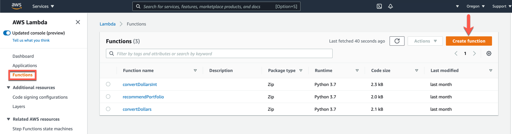
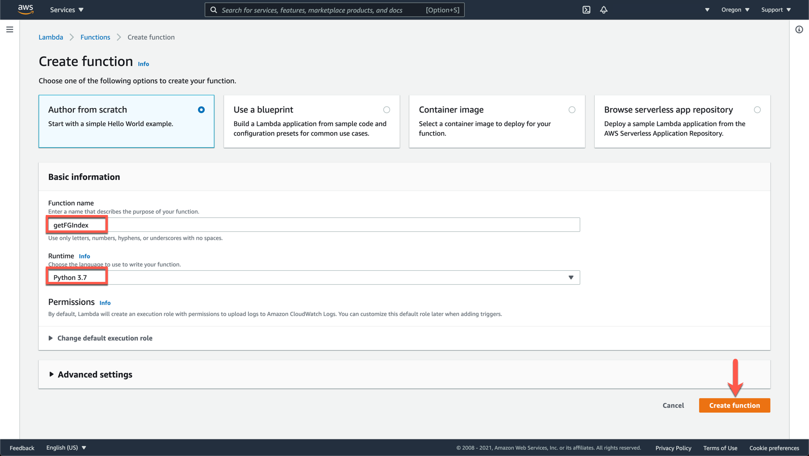
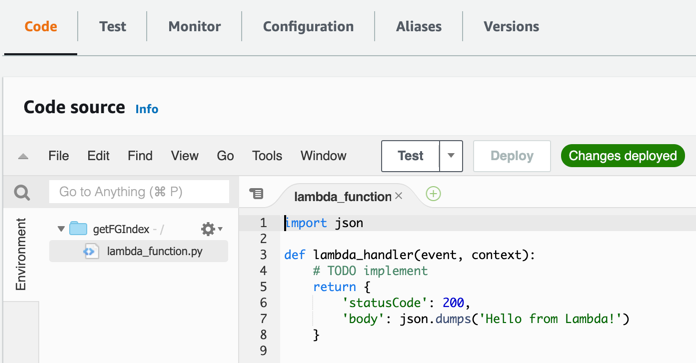
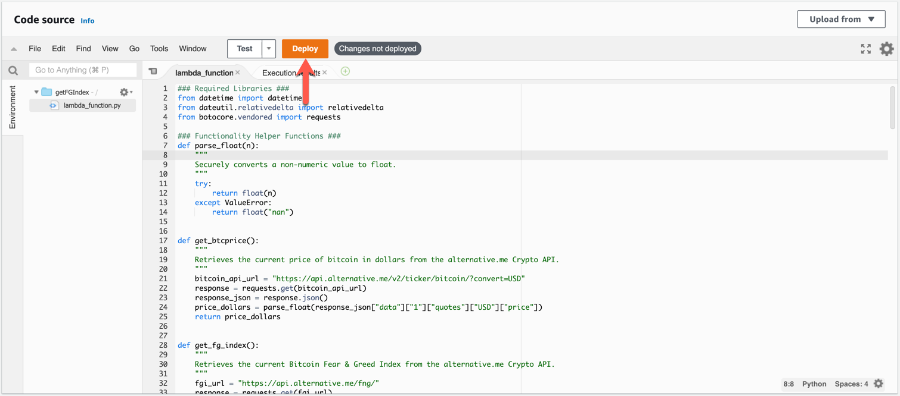
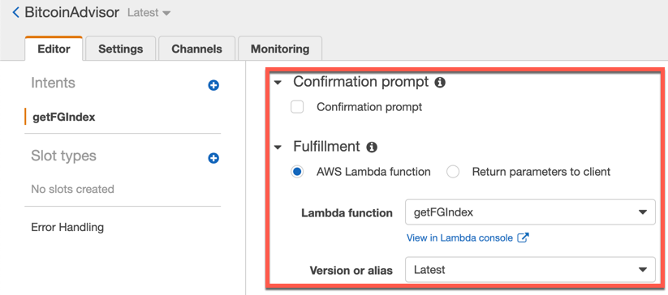

# Module 15: Virtual Class 1 Lesson Plan (2 hours)

## Overview

This session aims to strengthen the importance of the cloud for the FinTech industry and to make sure that all students have access to Amazon Web Services (AWS).

The first section of the class will reflect on the importance of cloud services as a core skill for FinTech professionals and its relevance for the FinTech industry. It will also help verify that all students have access to the AWS Console and that they understand the scope of the free tier for the AWS services we will use in this module.

In the second section of the class, you will recap how Amazon Lex and AWS Lambda work, and students will have a chance to have hands-on practice with this tool.

**Note:** To better ensure students come to class prepared, consider slacking a friendly reminder to the students to complete all the installations in this week's Async content prior to today's class.

## Learning Objectives

By the end of the session, students will be able to do the following:

* Demonstrate how to log into the AWS Console and navigate through the services it provides.

* Create conversational interfaces using Amazon Lex.

* Apply their Python skills to add new features to an Amazon Lex bot using Amazon Lambda.

---

## Time Tracker

| Start   | # | Activity Name                                                | Duration |
|---------|---|--------------------------------------------------------------|----------|
| 7:00 PM | 1 | Instructor Do: Welcome Students & Student Check-in           | 0:10     |
| 7:10 PM | 2 | Instructor Do: Amazon Web Services Check-Up                  | 0:20     |
| 7:30 PM | 3 | Instructor Do: Creating a Chatbot Using Amazon Lex           | 0:15     |
| 7:45 PM | 4 | Student Do: Bitcoin Fear & Greed Advisor                    | 0:20     |
| 8:05 PM | 5 | Instructor Do: Review Bitcoin Fear & Greed Advisor           | 0:10     |
| 8:15 PM | 6 | Instructor Do: Enhancing a Chatbot Using AWS Lambda          | 0:15     |
| 8:30 PM | 7 | Student Do: Enhancing the Bitcoin Fear & Greed Advisor      | 0:20     |
| 8:50 PM | 8 | Instructor Do: Review Enhancing Bitcoin Fear & Greed Advisor | 0:10     |
| 9:00 PM | 9 | End                                                          |          |

---

## Instructor Do: Office Hours (30 min)

Welcome to Office Hours, and Module 15 of the course: AWS Machine Learning and Robo Advisors. Remind the students that this is their time to ask questions and get assistance from their instructional staff as they’re learning new concepts and working on the challenge assignment. Feel free to use breakout rooms to create spaces focused on specific topics, or to have 1:1s with students.

Expect that students may ask for assistance such as the following:

* Challenge assignment.

* AWS signing in issues.

* AWS Free Tier

* Avoiding additional billing of AWS resources.

* Communication issues between AWS Lambdas and Amazon Lex

---

## Class Activities

### 1. Instructor Do: Welcome Students & Student Check-in (10 min)

Welcome students to the class. Congratulate them on successfully reaching the last module of the machine learning section of the program.

Getting started with Amazon Web Services may be challenging for students that have never used a cloud services platform. Let's take a moment to check in with the class and see how comfortable they're feeling creating an Amazon Web Services account and setting up their working environment.

Stop sharing your screen for a moment and switch to [Gallery View](https://support.zoom.us/hc/en-us/articles/201362323-Changing-the-video-layout-Speaker-view-and-Gallery-view-) in Zoom to see your class on one screen. You can find this option in the top right.

Ask your class to rate their understanding level by raising their hand for a "Fist-to-Five" check. A closed fist (0) means they are lost on the topic and need much more help. An open hand (5) means they completely understand everything that was covered and feel confident and ready to go.

Use the feedback from this check to recommend Office Hours to review things more in-depth, or adjust your pace throughout the rest of the class.

Explain to students that today will be a collaborative and creative class. The class will start with a check-up activity where the goal is to have everyone logged into AWS and ensuring that they created their IAM administrator user and their Amazon S3 buckets.

Be sure that there are no questions before moving forward.

---

### 2. Instructor Do: Amazon Web Services Check-Up (20 min)

This activity is intended to be sure that all students have created their AWS accounts and they have created the following resources required in the introduction lesson of this module:

* An AWS account.

* An Administrator user.

* AWS usage alerts.

* An Amazon S3 bucket.

It's crucial to ensure that all students have these resources up and running to succeed in this module's activities. For each of the AWS resources listed above, conduct a pulse check activity as follows.

Remain in [Gallery View](https://support.zoom.us/hc/en-us/articles/201362323-Changing-the-video-layout-Speaker-view-and-Gallery-view-) for this activity so that you can see your class on one screen.

Ask your class to find the [Zoom Meeting Reactions](https://support.zoom.us/hc/en-us/articles/115001286183-Non-verbal-feedback-and-reactions-) found in the Meeting Controls panel at the bottom of the Zoom window. Have them select the thumbs up 👍 emoji if they have successfully created and configured the particular AWS resource you are checking-up.

Use the feedback from this check to recommend Office Hours to review things more in-depth, or adjust your pace throughout the rest of the class.

Be sure that there are no questions before moving forward.

---

### 3. Instructor Do: Creating a Chatbot Using Amazon Lex (15 min)

In this activity, you will review with students the process of creating a Chatbot using Amazon Lex. After this activity, students should be able to create an intent to establish a simple dialog with a bot using version 1 of Amazon Lex.

Start the class by briefly reviewing the following core concepts of Amazon Lex.

* **Bot**: The core component of Amazon Lex. A bot performs automated tasks, such as booking a hotel, making a wire transfer, or suggesting an investment portfolio.

* **Intent**: An action that the user wants to perform, such as `BookHotel`, `TransferMoney`, or `SuggestPortfolio`. A bot can have more than one intent.

* **Utterance**: A speech or text phrase that triggers the intent. This refers to the dialogue between the user and the bot. An example is: I want to send 100 dollars to Laila.

* **Slot**: An allotted place for a piece of data that the chatbot needs to fulfill the user’s intent. Think of it as a required user-input item.

* **Prompt**: A question that asks the user to input data.

* **Fulfillment**: The business logic that the chatbot needs to fulfill the user’s intent. When the chatbot has collected all the slot values, it proceeds with the logic in the fulfillment section. This is where you can use an AWS Lambda function if you need business logic.

Explain to students that today you will work together on creating a chatbot that will advise users whether or not to invest in bitcoin according to the "Fear & Greed Index." Introduce this index as follows:

* The "Fear & Greed Index" tries to analyze the emotions and sentiments about a cryptocurrency and express them as a single number.

* This index takes information from various sources such as social media, surveys, Google Trends data, coin volatility, the dominance of a coin, and volume.

* There are several websites and crypto exchanges that offer similar indicators. For this demo, we will use the Bitcoin Feed & Greed Index that is freely available through [the Alternative.me crypto API](https://alternative.me/crypto/fear-and-greed-index/).

* In this index, a value of 0 means "Extreme Fear" while a value of 100 represents "Extreme Greed".

#### Creating the Bitcoin Advisor Bot

Continue the class by opening your browser and logging in to the AWS console using your IAM Administrator user. After logging into the AWS Console, type `Lex` on the services search bar. Next, click on "Amazon Lex" to open it as it's shown in the image below.


From the AWS regions list, select "US West (Oregon)" and recall to students that Amazon Lex is available only in a few AWS regions. The regions where this service is supported are highlighted in white font color, as it can be seen in the image below.


Explain to students that currently, Amazon Lex supports two different versions. In this Module we will work with Version 1 since Version 2 was launched on January 22nd, 2021, and bots created in Version 1 are not compatible with this new version. Slack out [the Amazon Lex Version 2 launching notice from Amazon](https://aws.amazon.com/about-aws/whats-new/2021/01/launching-amazon-lex-v2-console-apis-improved-bot-building-experience/) for further reference.

Continue by clicking on the "Create" button of the Amazon Lex console to start a brand new bot. This button is highlighted below.


Next, in the "Create your bot" page, choose the "Custom bot" option and fill-out the following:

* Bot name: BitcoinAdvisor

* Language: English (US)

* Output voice: Matthew

* Session timeout: 5 min

* Sentiment analysis: No

* IAM role: Leave default value

* COPPA: No

* Advanced options: No

Highlight to students that the reason for selecting No in the "Advance options" item concerns information privacy. Selecting Yes causes the dialogues to be sent as training data to improve AWS algorithms. If they ever create an Amazon Lex bot for any company, we recommend reviewing the company's information privacy policies before selecting Yes.

#### Creating the getFGIndex Intent

Now it's time to create an intent to establish a conversation with the user to fetch the "Bitcoin Fear & Greed Index."

Click on the "Create Intent" button; you will see a pop-up window entitled "Add intent" as you can see below. Next, click on the "Create intent" option to continue.


Next, you should give a name to the intent. Explain to students that usually intents are named as actions to be performed by the bot, then type `getFGIndex`, and click on the "Add" button to continue, as is shown below.


Continue the demo by adding the following sample utterances.

* I want to invest in bitcoin

* I want to buy bitcoin

* How is the bitcoin market feeling today

At this point, explain to the students that these sample utterances will be used by the deep learning algorithms of Amazon Lex to understand the conversation context. The more sample utterances they add, the better the conversation will flow between the bot and the user. Your sample utterances will look as in the image below.


#### Adding Slots

Continue by adding the following slot.

* Name: amount

* Slot type: AMAZON.NUMBER

* Prompt: How many dollars do you want to buy?

Make sure that "Required" option of the slot is checked. Your final slot configuration should look like the image below.


#### Setting the Confirmation Prompt Section

In this initial part of the demo, the bot will respond without using an AWS Lambda function, so we need to set up the confirmation prompt section. Expand the "Confirmation prompt" section, enable the "Confirmation prompt" checkbox and type the following confirm and cancel prompts:

* Confirmation prompt: Are you sure you want to buy ${amount} dollars to bitcoin?

* Cancel prompt: Okay, let's start again.

Your confirmation and cancel prompts should look as follows.


Explain to students that in the confirmation prompt, `{amount}` is like a variable, which will be replaced with the value that the user supplies in the conversation.

#### Testing the Bot

Now it is time to see the bot in action, build your bot by clicking on the "Build" button, and confirming the build option on the pop-up window as it's shown in the image below.


The building process takes a couple of minutes. Once the process is finished, you will see the confirmation message, and the Test bot window will appear as you can see in the image below. You can now close the confirmation message and test your bot.


Test your boot using the `I want to buy bitcoin` sample utterance. You should have a dialog with the bot as follows.


Explain to students that at this time, the bot has no business rules logic attached; that is why the final message the bot sends after fulfilling all the slots is a kind of non-friendly confirmation message, as can be seen in the image below. We will improve this later by adding an Amazon Lambda function to the bot.


Be sure that there are no questions before moving forward.

---

### 4. Student Do: Bitcoin Fear & Greed Advisor (20 min)

In this activity, students will replicate the steps you made to create their Bitcoin Fear & Greed Advisor.

**Files:**

[Instructions](Activities/01_Stu_Bit_and_Fear_Bot/README.md)

Take a moment to check in with the class and see how comfortable they're feeling with creating a bot by themselves using Amazon Lex by following the steps your explain before.

Stop sharing your screen for a moment and switch to [Gallery View](https://support.zoom.us/hc/en-us/articles/201362323-Changing-the-video-layout-Speaker-view-and-Gallery-view-) in Zoom to see your class on one screen. Ask your class to rate their level of understanding by raising their hand for another "Fist-to-Five" check. Use the feedback from this check to adjust your pace throughout the rest of the class and assist those students having issues during the activity.

Slack out the instructions to students and explain that they will work independently. You can leave the Gallery View on and kindly ask students to turn on their cameras to encourage group collaboration. Encourage students to open their microphones and ask any questions they may have. Ask your TAs to be aware of the class Slack channel if any questions or issues arise.

#### Instructions

##### Create the Bitcoin Advisor Bot

1. Log-in to the AWS Management Console using your Administrator IAM user, navigate to the Amazon Lex console and create a new custom bot with the following parameters:

    * Bot name: BitcoinAdvisor

    * Language: English (US)

    * Output voice: Matthew

    * Session timeout: 5 min

    * Sentiment analysis: No

    * IAM role: Leave default value

    * COPPA: No

    * Advanced options: No

##### Create the getFGIndex Intent

1. Add a new intent and name it `getFGIndex`.

2. Define some sample utterances, start by adding the following:

    * I want to invest in bitcoin

    * I want to buy bitcoin

    * How is the bitcoin market feeling today

##### Add Slots

1. Continue by adding the following slot.

    * Name: amount

    * Slot type: AMAZON.NUMBER

    * Prompt: How many dollars do you want to buy?

> **Important:** Make sure to check the "Required" option of the slot.

##### Set the Confirmation Prompt Section

1. On the "Confirmation prompt" section, add the following confirm and cancel prompts.

    * Confirmation prompt: Are you sure you want to buy ${amount} dollars in bitcoin?

    * Cancel prompt: Okay, let's start again.

##### Test the Bot

1. Build the bot by clicking on the "Build" button.

2. Once the build process ends, test your bot with the sample utterances, you should have a final conversation flow like the following.


---

### 5. Instructor Do: Review Bitcoin Fear & Greed Advisor (10 min)

[Solution file](Activities/01_Stu_Bit_and_Fear_Bot/Solved/BitcoinAdvisor_1_a480b43b-0231-4c17-b4af-ad056f4ebf93_Bot_LEX_V1.zip)

By this point, you may have the Bitcoin Advisor bot created and running. However, if you need to created again, you can import the Amazon Lex package that is in the "Solved" folder.

Remaining in gallery view, have your class find the Zoom Meeting Reactions found in the Meeting Controls panel at the bottom of the Zoom window. As students to use the thumbs up 👍 emoji if they're feeling comfortable and confident creating their Bitcoin Advisor bot.

Use the feedback from this check to recommend Office Hours to review things more in-depth, or adjust your pace throughout the rest of the class.

Answer any pending questions from the class before moving forward.

---

### 6. Instructor Do: Enhancing a Chatbot Using AWS Lambda (15 min)

In this activity you will show students how to enhance the Bitcoin Advisor bot by adding business logic using AWS Lambda.

**Files:**

[lambda_function.py](Activities/02_Ins_AWS_Lambda/Solved/lambda_function.py)

Explain to students that in this activity, you will show them how to create a Python function using AWS Lambda to extend the current functionality of the Bitcoin Advisor bot and fetch the current Bitcoin Fear & Greed Index using [the Alternative.me crypto API](https://alternative.me/crypto/fear-and-greed-index/).

#### Creating the Lambda Function

Explain to students that AWS Lambda enhances chatbots by combining the NLP capabilities of Amazon Lex to understand human speech, with the possibility of running code to fulfill user's requests, for example, booking a hotel room, making a wire transfer, or providing financial advice about an investment portfolio.

Log into the AWS Management Console using your IAM administrator user. Once you are logged in, type `Lambda` into the AWS services search box and click on "Lambda" to open the AWS Lambda console. The process is shown in the image below.


In the AWS Lambda console, click on "Functions" on the left side menu; continue by clicking on the "Create function" button as you can see in the image below.



On the Create function page, select the Author from scratch option, fill out the following information, and click on the Create function button to continue.

* Function name: getFGIndex (This is the name to identify our new Lambda function).

* Runtime: Python 3.7

The basic information section of the Lambda function should look like the image below.



Explain to students that now AWS will create the `getFGIndex` Lambda function, and it takes a few seconds. Once created, you will see the following page.


Scroll down to the "Code source" section and explain to students that the code in the `lambda_function.py` script is a starter template example. Highlight that a lambda function has a main events handler; its goal is to manage all the incoming messages and dispatch them depending on the business logic defined. The following image shows the "Code source" section and the sample code.



Explain to students that AWS Lambda functions are designed to manage events that other AWS services can trigger. Depending on the service we may want to connect with Lambda, we will have different approaches to code the Lambda function. Today, we will focus on learning how to structure a Lambda function to interact with Amazon Lex.

Explain to students that at glance, an AWS Lambda function that interacts with Amazon Lex may contain six general building blocks as follows.

1. **Required Libraries:** This block contains all the necessary libraries to code the business logic of the lambda function, though AWS Lambda supports Python, the runtime doesn't support some common packages such as `pandas`, `numpy` or `requests`, so alternative packages should be used or installed.

2. **Functionality Helper Functions:** These functions implement business logic and data validation.

3. **Dialog Actions Helper Functions:** These functions handle the input and response events data from the "conversation" between Amazon Lex and AWS Lambda.

4. **Intents Handlers:** The core business logic is coded into an intent handler. An intent handler is a function that implements the functionality that is willing to fulfill the user's intent.

5. **Intents Dispatcher:** An Amazon Lex bot can have one or more intents. Normally, this block contains a function called `dispatch()` whose purpose is to validate that the current intent is valid and to dispatch the intent to the corresponding intent handler.

6. **Main Handler:** Every time a user sends a message to Lex, using text or voice, an event will be sent to Lambda. In this block, usually we have the `lambda_handler()` function; it catches every event and returns a response to Lex via the `dispatch()` function.

After presenting the Lambda function's building blocks, open the provided Lambda function in VSCode, then copy and paste the code to the code editor on the AWS Lambda console as it's shown in the image below. You may have to double click on the `lambda_function.py` file in the Environment pane to open the editor.


Explain to students that now you will build the function and connect AWS Lambda with Amazon Lex. Later, they will have a chance to inspect this code. Click on the Deploy button to continue as it's shown in the image below.



#### Connecting AWS Lambda and Amazon Lex

Open the Amazon Lex console to bind the `getFGIndex` lambda function to the "Bitcoin Advisor" bot. Open the "Lambda initialization and validation" section, enable the Initialization and validation code hook option and select the `getFGIndex` Lambda function from the list. Make sure to select the Latest version. The process is presented in the image below.


A pop-window will appear next, asking you for permission to invoke your Lambda Function. Click on the "Ok" button to continue. Explain to students that this permission is needed to allow the communication between the bot and Lambda. The message can be seen in the image below.


Scroll down to the "Confirmation prompt" section and disable the checkbox. Next, open the "Fulfillment" section and choose the "AWS Lambda function" option; select the `getFGIndex` Lambda and the `Latest` version. Click on the Build button in the upper right corner as you can see in the image below. Now the bot is connected to Lambda and the Lambda function will control the user's intent.



Test the Lambda powered bot with some of the sample utterances; you should have a final conversation as it is shown below.

| _Bot demo conversation with valid user's data_ | _Bot demo conversation with invalid user's data_ |
| --- | ---|
|  |  |

Answer any pending questions from the class before moving forward.

---

### 7. Student Do: Enhancing the Bitcoin Fear & Greed Advisor (20 min)

In this activity, students will follow the steps you made to add an AWS Lambda function to their Bitcoin Fear & Greed Advisor.

**Files:**

[Instructions](Activities/03_Stu_AWS_Lambda/README.md)

[Starter code](Activities/03_Stu_AWS_Lambda/Unsolved/lambda_function.py)

Take a moment to check in with the class and see how comfortable they're feeling with adding an AWS Lambda function to an Amazon Lex bot by themselves.

Stop sharing your screen for a moment and switch to Gallery View. As your class to rate their level of understanding by raising their hand for a "Fist-to-Five" check. Use the feedback from this check to adjust your pace throughout the rest of the class and assist those students having issues during the activity.

Slack out the instructions to students and explain that they will work independently. You can leave the Gallery View on and kindly ask students to turn on their cameras to encourage group collaboration. Encourage students to open their microphones and ask any questions they may have. Ask your TAs to be aware of the class Slack channel if any questions or issues arise.

#### Instructions

##### Create the Lambda Function

1. Log-in into the AWS Management Console using your IAM administrator user. Once you are logged in, type `Lambda` into the AWS services search box and click on "Lambda" to open the AWS Lambda console.

2. In the AWS Lambda console, click on "Functions" on the left side menu; continue by clicking on the "Create function" button.

3. On the Create function page, select the "Author from scratch" option, fill out the following information, and click on the "Create function" button to continue.

    * Function name: `getFGIndex` (This is the name to identify our new Lambda function).

    * Runtime: Python 3.7

4. Scroll down to the "Code source" section and copy and paste the starter code provided to the code editor on the AWS Lambda console. You may have to double click the `lambda_function.py` file in the Environment pane to open the editor.

5. Inspect the code of the `get_df_index()` and `get_recommendation()` functions to understand how the "Bitcoin Fear & Greed Index" is retrieved and how the recommendation is made.

6. Click on the "Deploy" button and continue with the next section.

##### Test the Lambda Function

1. Add two test events using the tests provided in the JSON files.

2. Run the tests and ensure that the Lambda function works correctly.

##### Connect AWS Lambda and Amazon Lex

1. Open the Amazon Lex console to bind the `getFGIndex` lambda function to the "Bitcoin Advisor" bot.

2. Open the "Lambda initialization and validation" section, enable the Initialization and validation code hook option and select the `getFGIndex` Lambda function from the list. Make sure to select the Latest version.

3. Scroll down to the "Confirmation prompt" section and disable the checkbox, continue by opening the "Fulfillment" section and choose the "AWS Lambda function" option; select the `getFGIndex` Lambda and the `Latest` version.

4. Click on the Build button in the upper right corner. Congrats! Now the bot is connected to Lambda to control the user's intent.

5. Test the Lambda powered bot with some of the sample utterances; you should have a final conversation as it is shown below.

| _Bot demo conversation with valid user's data_ | _Bot demo conversation with invalid user's data_ |
| --- | ---|
|  |  |

##### Optional Challenge

In this optional challenge activity you will give a recommendation on buying Bitcoin according to the average "Bitcoin Fear & Greed Index" over the last ten days.

If you look at the [alternative.me API documentation](https://alternative.me/crypto/fear-and-greed-index/#api) for this index you can corroborate that the API endpoint to retrieve the index values for the last ten days is the following: <https://api.alternative.me/fng/?limit=10>. Follow the steps bellow to use this endpoint and accomplish this optional challenge.

1. Modify the code of the `get_fg_index()` function to fetch the "Bitcoin Fear & Greed Index" from the last ten days using the following endpoint: <https://api.alternative.me/fng/?limit=10>.

2. The `get_fg_index()` should return the average value of the index from the last ten days.

3. Optionally, update the text messages that are in the `get_recommendation()` function to reflect what the market feelings are from the last then days.

4. Build your Lambda function and test the Bitcoin Advisor bot again.

    > **Note:** Since you only modified the AWS Lambda code, you don't need to re-build the bot.

---

### 8. Instructor Do: Review Enhancing Bitcoin Fear & Greed Advisor (10 min)

[Solution files](Activities/03_Stu_AWS_Lambda/Solved/BitcoinAdvisor_2_bf1cc24c-3e77-43c9-bf88-31e59000a549_Bot_LEX_V1.zip)

[Required activity solution](Activities/03_Stu_AWS_Lambda/Solved/lambda_function.py)

[Optional challenge solution](Activities/03_Stu_AWS_Lambda/Solved/lambda_function_challenge.py)

By this point, you may have the Bitcoin Advisor bot created and running. However, if you need to create it again, you can import the Amazon Lex package that is in the "Solved" folder.

Remain in gallery view for a moment and ask your class to use the Zoom Meeting Reactions to use the thumbs up 👍 emoji if they're feeling comfortable and confident adding an AWS Lambda function to their Bitcoin Advisor bot. Use the feedback from this check to recommend Office Hours to review things more in depth.

Focus this review activity on the code for the challenge activity. Note that in this activity students were also asked to create test events for their Lambda function. Though not reviewed in class, students should be familiar with this from their async content.

Share your screen and comment on the solution code below. Start by reviewing the `get_fg_index()` function.

```python
def get_fg_index():
    """
    Retrieves the average Bitcoin Fear & Greed Index from the last ten days
    """

    # Fetch the Bitcoin Fear & Greed Index from the last ten days
    fgi_url = "https://api.alternative.me/fng/?limit=10"
    response = requests.get(fgi_url)
    response_json = response.json()

    # Create a list with the data of the index from the last ten days
    fg_index_list = response_json["data"]

    # Compute the sum of the index values over the last ten days
    index_sum = 0
    for index in fg_index_list:
        index_sum = index_sum + parse_float(index["value"])

    # Compute the average value of the index over the last ten days
    avg_index = index_sum / len(fg_index_list)

    return avg_index
```

Explain to students that after fetching the index from the last ten days, a list is created in the `fg_index_list` variable to store all the index values. Next, a `for` loop is used to compute the sum of the index values. Finally, the average index value is computed and returned.

Let's move to the `get_recommendation()` code that is shown below.

```python
def get_recommendation():
    """
    Returns a buying recommendation based on the average value of the Bitcoin Fear & Greed Index from the last ten days.
    """
    fg_index = get_fg_index()
    recommendation = ""
    if fg_index >= 0 and fg_index <=25:
        recommendation = "Be cautious on buying bitcoin today since the market felt 'Extreme Fear' the last ten days."
    elif fg_index > 25 and fg_index < 50:
        recommendation = "Be cautious on buying bitcoin today since the market felt 'Fear' the last ten days."
    elif fg_index == 50:
        recommendation = "You may buy bitcoin today since the market felt 'Neutral' the last ten days."
    elif fg_index > 50 and fg_index <= 75:
        recommendation = "You may buy bitcoin today, the market felt 'Greed' the last ten days."
    else:
        recommendation = "You may buy bitcoin today, the market felt 'Extreme Greed' the last ten days."
    return recommendation
```

For this function, explain to students that we only updated the text messages of the rules to reflect that the recommendation is made on the average value of the index over the last ten days.

Answer any pending questions from the class before moving forward.

---

## Open Office Hours

### Q&A and System Support

This is an opportunity to support students in any way that they require.

* Offer personalized support for students. (**Note:** feel free to pair individual students off with instructional staff as needed.)

* Ask the students if they have any questions about the material covered in today's live lesson.

* Ask students if they have any questions about the material covered in the async content or the Challenge assignment.

---

© 2021 Trilogy Education Services, a 2U, Inc. brand. All Rights Reserved.
