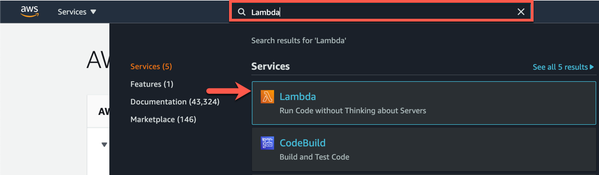
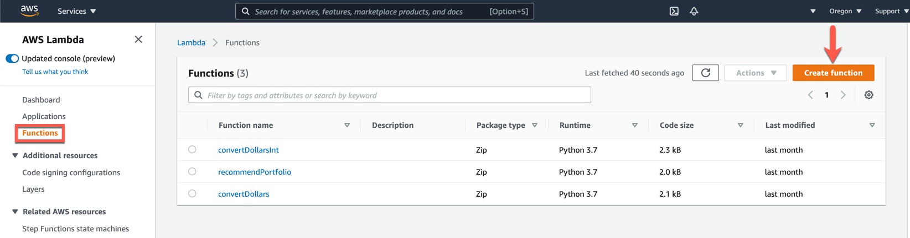
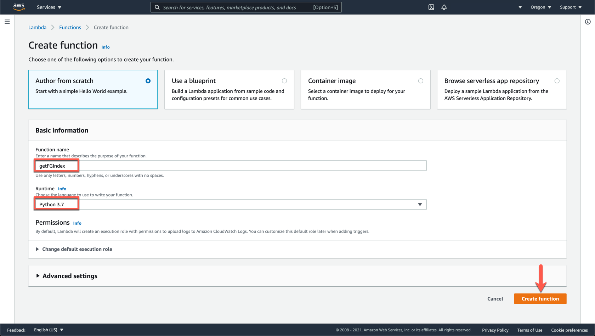
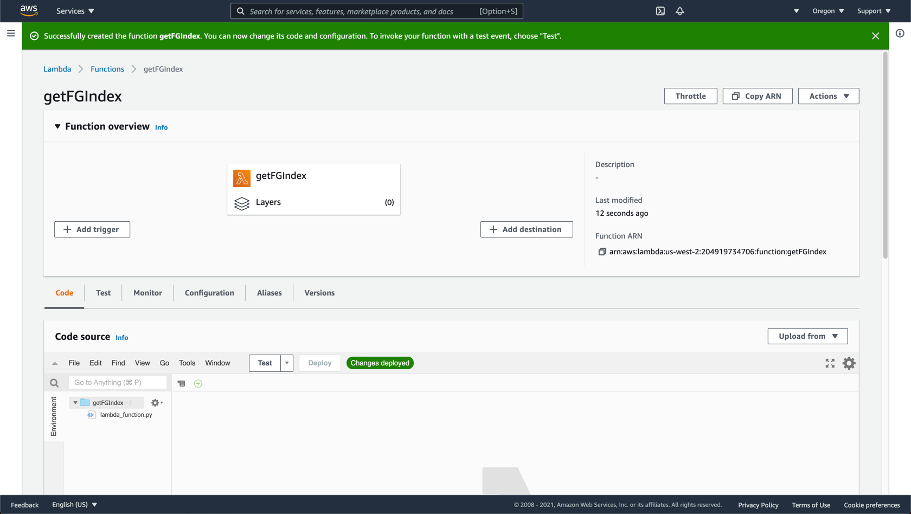
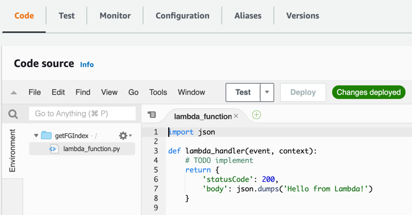
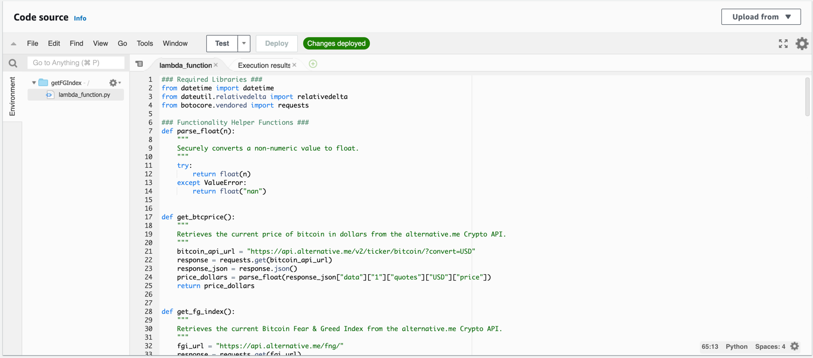
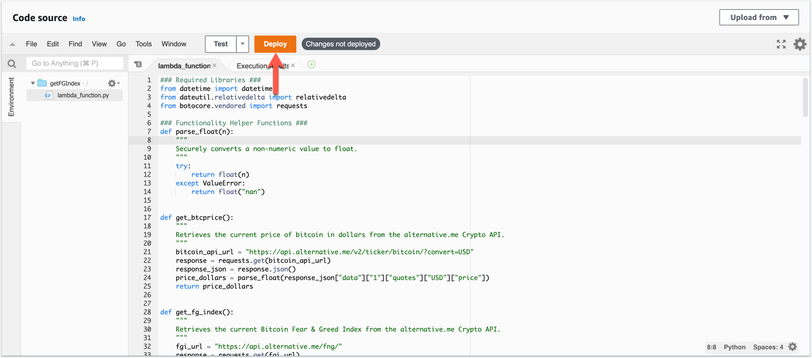
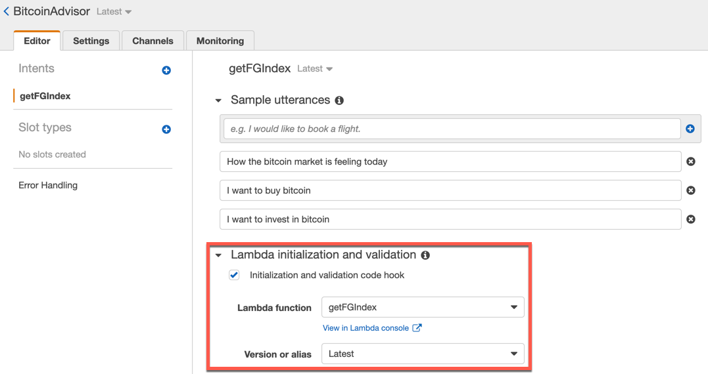
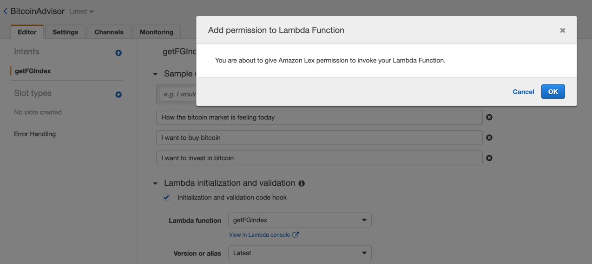
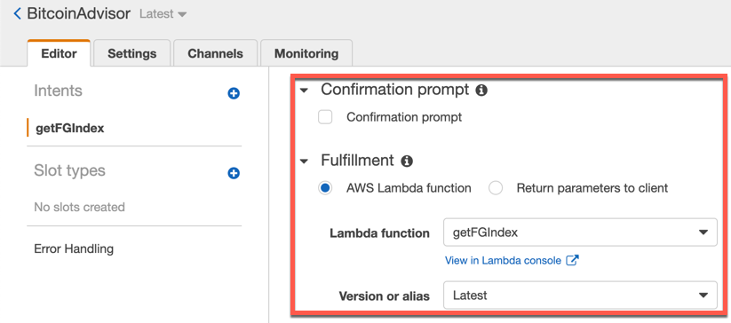

# Creating the Lambda Function

Log into the AWS Management Console using your IAM administrator user. Once you are logged in, type `Lambda` into the AWS services search box and click on "Lambda" to open the AWS Lambda console. The process is shown in the image below.

In the AWS Lambda console, click on "Functions" on the left side menu; continue by clicking on the "Create function" button as you can see in the image below.

On the Create function page, select the Author from scratch option, fill out the following information, and click on the Create function button to continue.

* Function name: getFGIndex (This is the name to identify our new Lambda function).

* Runtime: Python 3.7

The basic information section of the Lambda function should look like the image below.

 Once created, you will see the following page.

 The following image shows the "Code source" section and the sample code.

open the provided Lambda function in VSCode, then copy and paste the code to the code editor on the AWS Lambda console as it's shown in the image below. You may have to double click on the `lambda_function.py` file in the Environment pane to open the editor.

 Click on the Deploy button to continue as it's shown in the image below.

#### Connecting AWS Lambda and Amazon Lex

Open the Amazon Lex console to bind the `getFGIndex` lambda function to the "Bitcoin Advisor" bot. Open the "Lambda initialization and validation" section, enable the Initialization and validation code hook option and select the `getFGIndex` Lambda function from the list. Make sure to select the Latest version. The process is presented in the image below.

A pop-window will appear next, asking you for permission to invoke your Lambda Function. Click on the "Ok" button to continue. 

Scroll down to the "Confirmation prompt" section and disable the checkbox. Next, open the "Fulfillment" section and choose the "AWS Lambda function" option; select the `getFGIndex` Lambda and the `Latest` version. Click on the Build button in the upper right corner as you can see in the image below. Now the bot is connected to Lambda and the Lambda function will control the user's intent.

Test the Lambda powered bot with some of the sample utterances; DONE

