# Module 15: Virtual Class 2 Lesson Plan (2 hours)

## Overview

This session will reinforce students' skills in Amazon SageMaker Studio. Students will also debate the pros and cons of using the Cloud to deploy machine learning models.

As FinTech professionals, students may be responsible for deciding or advising on the convenience of whether or not to use the Cloud to deploy machine learning models. In the first section of the class, students are encouraged to debate on this topic after a brief collaborative research activity.

In the second section of the class, you will recap how Amazon SageMaker Studio works, and students will have a chance to have hands-on practice with this tool.

## Learning Objectives

By the end of the session, students will be able to do the following:

* Describe the pros and cons of using the cloud in the FinTech industry.

* Understand how Amazon SageMaker Studio works and use it to deploy machine learning models.

* Identify FinTech business cases where Amazon SageMaker can be used to enhance decision making.

---

## Time Tracker

| Start   | # | Activity Name                                                                         | Duration |
|---------|---|---------------------------------------------------------------------------------------|----------|
| 7:00 PM | 1 | Instructor Do: Welcome Students & Student Check-in                                    | 0:10     |
| 7:10 PM | 2 | Instructor Do: Amazon SageMaker Studio Check Up                                       | 0:15     |
| 7:25 PM | 3 | Student Do: Pros and Cons of Deploying Machine Learning Models in the Cloud           | 0:20     |
| 7:45 PM | 4 | Instructor Do: Review Pros and Cons of Deploying Machine Learning Models in the Cloud | 0:10     |
| 7:55 PM | 5 | Instructor Do: Deploying a Machine Learning Model Using Amazon SageMaker Studio       | 0:15     |
| 8:10 PM | 6 | Student Do: Preventing Money Laundering Using Amazon SageMaker Studio                 | 0:30     |
| 8:40 PM | 7 | Instructor Do: Review Preventing Money Laundering Using Amazon SageMaker Studio       | 0:10     |
| 8:50 PM | 8 | Instructor Do: Recap                                                                  | 0:10     |
| 9:00 PM | 9 | End                                                                                   |          |

---

## Instructor Do: Office Hours (30 min)

Welcome to Office Hours, and the second Live Lesson of Module 15: AWS Machine Learning and Robo Advisors. Remind the students that this is their time to ask questions and get assistance from their instructional staff as they’re learning new concepts and working on the challenge assignment. Feel free to use breakout rooms to create spaces focused on specific topics, or to have 1:1s with students.

Expect that students may ask for assistance such as the following:

* Challenge assignment.

* AWS signing in issues.

* AWS Free Tier

* Avoiding additional billing of AWS resources.

* Running a machine learning model using Amazon SageMaker Studio.

---

## Class Activities

### 1. Instructor Do: Welcome Students & Student Check-in (10 min)

Welcome students to the second live class of Module 15. Explain to students that today you will work with Amazon SageMaker Studio. Though using this service is not required for this module's challenge, it's a powerful tool that will be an ally in their career as FinTech professionals every time they need to deploy a machine learning model in the cloud. Also, remind students that they can use SageMaker studio as part of their second project.

Stop sharing your screen for a moment and switch to Gallery View in Zoom. Ask your class to rate their understanding level of working with Amazon SageMaker Studio by raising their hand for a "Fist-to-Five" check. A closed fist (0) means they are lost on the topic and need much more help. An open hand (5) means they completely understand everything that was covered and feel confident and ready to go.

Use the feedback from this check to recommend Office Hours to review things more in depth, or adjust your pace throughout the rest of the class.

Explain to students that today will be a collaborative and creative class. The class will start with a check-up activity where the goal is to have everyone logged into AWS and ensuring that they can open Amazon SageMaker Studio.

Be sure that there are no questions before moving forward.

---

### 2. Instructor Do: Amazon SageMaker Studio Check Up (15 min)

In this activity you need to ensure that all students are able to login into AWS using their IAM administrator user and that they can open SageMaker Studio. This activity can take more or less time depending on the number of students you have in class; since it takes about five minutes to launch Studio for the first time, consider the time spent in this activity and adjust the activity times for the rest of the class accordingly.

Take a moment to check in with the class and see how many students have already reached Lesson 3 and launched Amazon SageMaker Studio for the first time.

Remaing in Gallery View and ask your class to use the Zoom Meeting Reactions found in the Meeting Controls panel at the bottom of the Zoom window to use the thumbs up 👍 emoji if they're already launched and configures Amazon SageMaker Studio for the first time.

Depending on how many students have already configured SageMaker Studio, you can assist them individually or by creating breakout rooms. If just a few have configured SageMaker Studio, conduct a demonstration following the steps below.

> **Important:** To follow the next steps, you may need to delete your current Amazon SageMaker Studio domain. To do so, follow the steps described in [this article of the Amazon SageMaker Developer Guide](https://docs.aws.amazon.com/sagemaker/latest/dg/gs-studio-delete-domain.html#gs-studio-delete-domain-studio).

Ask students to login into the AWS Console using their IAM administrator user, you may choose not to share your screen in this step for privacy reasons.

After logging into the AWS Console, start sharing your screen to students. Ask the class to follow your steps as you go through the process of Launching Amazon SageMaker Studio and highlight the following:

* Now, we are going to launch Amazon SageMaker Studio. To do so, we type sagemaker in the Find Services search box, and we click on the Amazon SageMaker option in the drop down menu.

  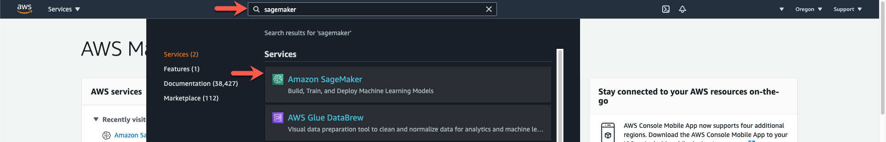

* Amazon SageMaker is not available in all AWS Regions. In today's class, we will use the US West (Oregon) region.

At this point, you will have opened the Amazon SageMaker console as it's shown in the image below. Be sure you choose the US West (Oregon) AWS Region before you continue.

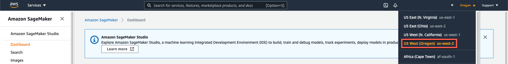

Explain to students that before we can start using Studio, we need to create an application instance. An **application instance** is a group of elements in the cloud (such as virtual machines, cloud storage, IAM users, and security policies) that we need to host a running Studio environment.

* In the navigation pane on the left side, click Amazon SageMaker Studio, as the following image shows:

  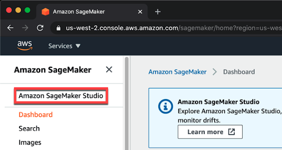

* The first step is creating a new IAM user. However, we can let Amazon SageMaker handle the configuration as follows: in the SageMaker Studio pane on the right side, leave the “Quick start” option selected, and leave the default user in the “User name” box. The following image shows these items:

  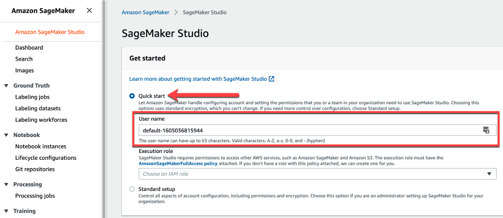

* Note that to allow Amazon SageMaker to connect to other services, we need to define an execution role and an Amazon S3 bucket for sharing data. So, in the “Execution role” drop-down list, click “Create a new role,” as the following image shows:

  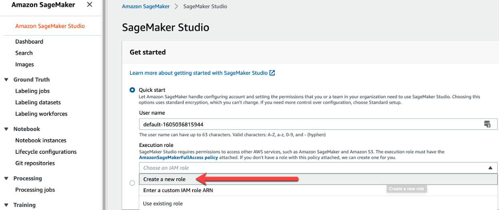

* In the “Create an IAM role” dialog box that appears, configure the new role. To do so, select the “Specific S3 buckets” option, and then in the “Specific S3 buckets” box, type the name of the Amazon S3 bucket that you created back in the Getting Started section of this module. Recall that the recommended bucket name was “fintech-bootcamp-activities-,” followed by the initials of your name, then another hyphen, and then the current date using hyphens to separate digits. (Example: `fintech-bootcamp-activities-jams-2021-02-11`). Then click the “Create role” button, as the following image shows:

  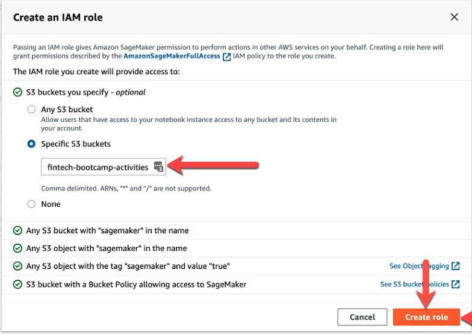

* Note that a confirmation message appears, which states “Success! You created an IAM role.” The following image shows this message:

  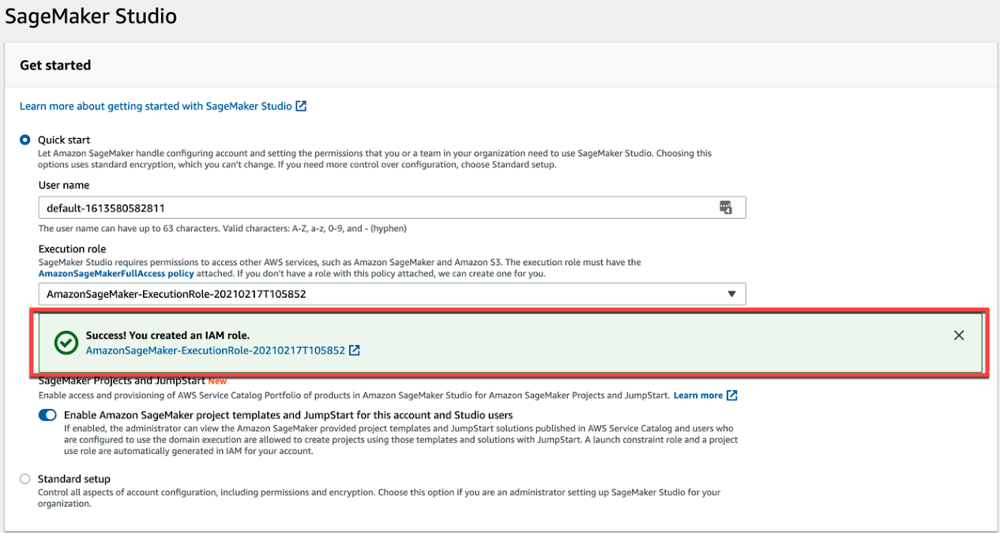

* Click the Submit button to create the Studio instance. A “Preparing SageMaker Studio” message appears, as the following image shows:

  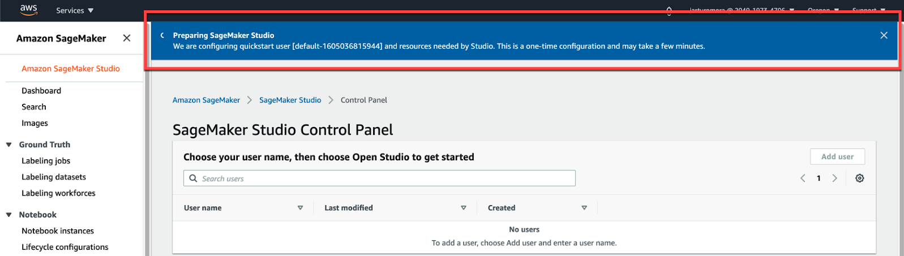

* Note that after a few minutes, the Studio instance is ready, and the “SageMaker Studio is ready” message appears, as the following image shows:

  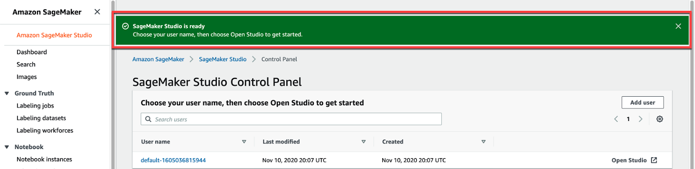

* Now, we can launch Amazon SageMaker Studio. To do so, in the SageMaker Studio Control Panel, click the Open Studio link, as the following image shows:

  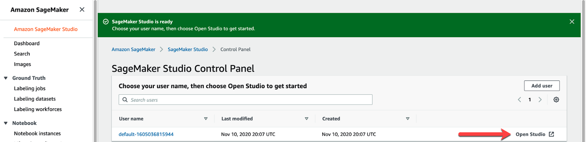

* Note that the Studio loading page appears, which states “Amazon SageMaker Studio: Loading the JupyterServer application default.” This page remains for up to five minutes the first time that we launch Studio, as the following image shows:

  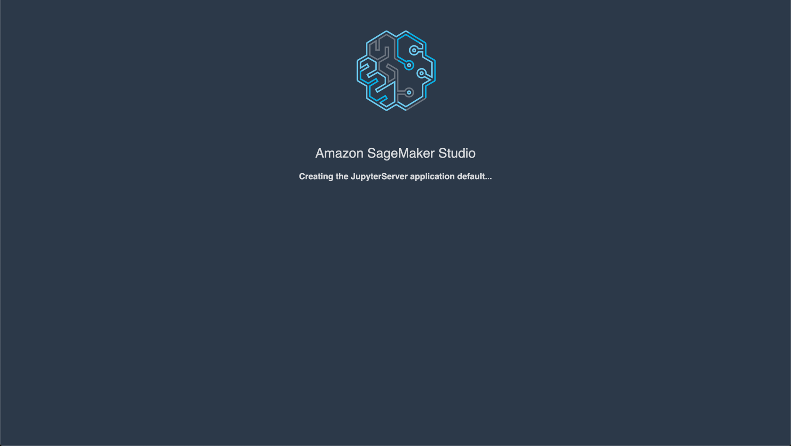

* Next, the Amazon SageMaker Studio user interface displays. It’s based on JupyterLab but differs slightly, as the following image shows:

  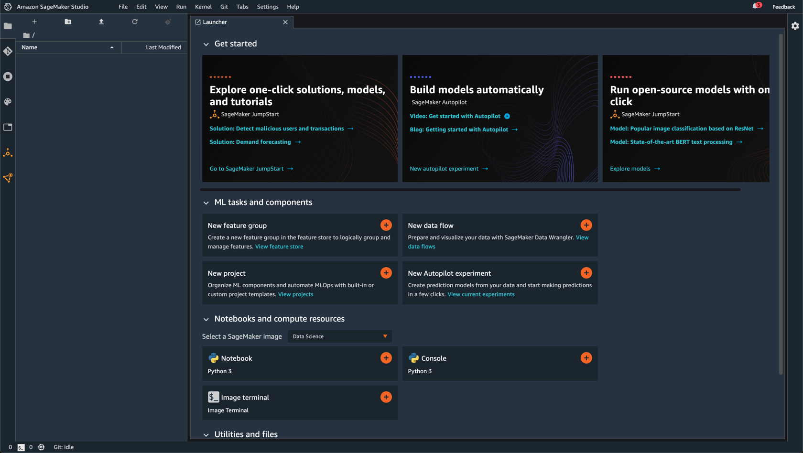

Explain to students that we’re now ready to start building and deploying machine learning models in the cloud!

Be sure that there are no questions before moving forward.

---

### 3. Student Do: Pros and Cons of Deploying Machine Learning Models in the Cloud (20 min)

In this activity students will work in groups to research the pros and cons of using the cloud to deploy machine learning models.

Files:

* [Activity Instructions](Activities/01-Stu_Pros_and_Cons_Cloud_ML/README.md)

Stop sharing your screen and explain to students that before getting started with SageMaker Studio, it's important for them as FinTech professionals to identify the pros and cons of using cloud services to deploy machine learning models.

Explain to students that they will work in groups. Some groups will be supporters of using cloud services to deploy machine learning models, and other groups will be against using the cloud for this purpose. To ease the groups' posture, you can say that those groups whose group number is odd are in favor of using the cloud, and groups whose group number is even are against it.

Create [Zoom Breakout Rooms](https://support.zoom.us/hc/en-us/articles/206476313-Managing-breakout-rooms) of 3-4 students. Zoom can automatically assign random students to the rooms based on the number of participants you want in each room.

Consider making a room specifically for instructional staff to prevent creating groups of students that are smaller than intended.

> **Important:** If class is being recorded to the cloud, only the main room will be recorded. However, if class is being recorded locally, it will record whichever room the host is in. Keep this in mind when having private conversations with your instructional team.

Slack-out the instructions and be aware if any group requires further assistance.

#### Instructions

1. Use the first ten minutes of this activity to search on the internet for technical blog posts, white papers, industry use cases, or research papers that can give you arguments to support your group's posture. Set a timer to have time for final conclusions.

2. You can use [the general Google engine](https://www.google.com/) to search for supporting evidence on the web, or you can use [Google Scholar](https://scholar.google.com/) to search for research papers, books, or technical notes.

3. As a starting point, you can read the following articles:

    * [Clever clouds: Considerations when outsourcing AI](https://www.accenture.com/us-en/insights/artificial-intelligence/key-cloud-considerations)

    * [The Benefits of Cloud Native ML And AI](https://medium.com/@ODSC/the-benefits-of-cloud-native-ml-and-ai-b88f6d71783)

    * [Cloud Native Machine Learning And AI](https://www.forbes.com/sites/forbestechcouncil/2018/07/05/cloud-native-machine-learning-and-ai/)

4. In the final minutes of the activity, write down your groups conclusions. It may be handy to have one of the group members share their screen and share a Google Doc where everyone can write.

5. Get ready to present your conclusions to the class.

---

### 4. Instructor Do: Review Pros and Cons of Deploying Machine Learning Models in the Cloud (10 min)

In this activity you will lead and facilitate a discussion around the convenience of deploying models in the cloud.

Stop sharing your screen for a moment and switch to Gallery View in Zoom. Ask each one of the groups that researched arguments in favor of using the cloud to deploy machine learning models to share one argument each. Next, ask the groups that researched arguments against using the cloud to share one argument each.

Close the activity by sharing your professional opinion about this matter, you may conclude with the following points:

**Pros:**

* Data storage capacity: By using a cloud storage service like Amazon S3, we could have trained a model on multiple terabytes of data, or a lot more space than would otherwise have fit in our personal computer.

* Hardware / GPU: By using machine learning cloud services, such as Amazon SageMaker instances to train our model, we can access compute power, including GPU capabilities, making powerful hardware available to us as required.

* Cost: Using cloud services such as AWS, Google Cloud, or Microsoft Azure, we only pay for what we use instead of paying to maintain in-house infrastructure.

**Cons:**

* Data privacy/security: By uploading data to a third party, you are trusting your data with them. Certain kinds of data are subject to compliance and regulatory constraints.

* Visibility: You won't have oversight on how a cloud services provider internally handles your data and infrastructure.

* Availability: Although there are service-level agreements (SLA) in place, cloud providers can and have suffered outages at times, causing data unavailability.

Answer any questions before moving on.

---

### 5. Instructor Do: Deploying a Machine Learning Model Using Amazon SageMaker Studio (15 min)

In this demo, students will learn how to deploy a machine learning model using Amazon SageMaker Studio.

> **Important:** Since training and deploying the model takes about 10 minutes, you will load a Jupyter notebook fille from your computer and conduct a dry walkthrough demonstration.

**Files:**

* [predicting_customer_churn.ipynb](Activities/02_Ins_SageMaker_Studio/Solved/predicting_customer_churn.ipynb)

* [customer_churn.csv](Activities/02_Ins_SageMaker_Studio/Resources/customer_churn.csv)

Explain to students that now you will demonstrate how we can deploy a machine learning model in the cloud using Amazon SageMaker Studio. Conduct a dry walkthrough demo and highlight the following:

* Now we will use SageMaker Studio to deploy a machine learning model to predict customer churn.

* Customer churn, also known as, customer attrition, customer turnover, or customer defection, is the loss of clients or customers. Due to the high financial impact on companies, looking for novel strategies to fight and predict customer churn is becoming a driver on adopting machine learning in the industry.

* Since training and deploying a machine learning model takes about 10 minutes, we will walk through the code by reviewing each cell. In the next activity, students will have time to practice this skill by themselves.

* Begin by importing the Jupyter notebook. To import an existing notebook, click on the "Upload Files" icon in the the left icon menu. Next, select the notebook you want to import into SageMaker Studio. In this case, we will import a notebook called `predicting_customer_churn.ipynb`.

  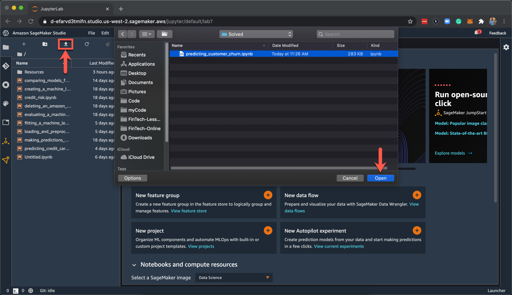

Continue by creating a new folder called "Resources" and upload the `churn_data.cvs` file into it.

Open the `predicting_customer_churn.ipynb` notebook. You'll probably see the message: "Select Kernel" or "Kernel not found", select "Python 3 (Data Science)" kernel and click on "Select" or "Set Kernel" to continue.

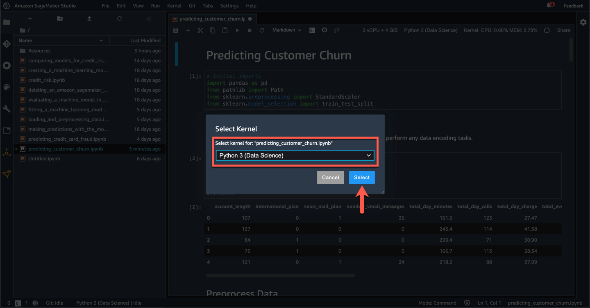

After loading the notebook and selecting the kernel, comment to students that the dataset contains data from a telephone company that aims to predict customer churn based on their current data. Continue as follows.

* As it can be seen, all features are numerical, so there is no need to encode any categorical data. However, we will scale the data later using the Scikit-learn's standard scaler.

  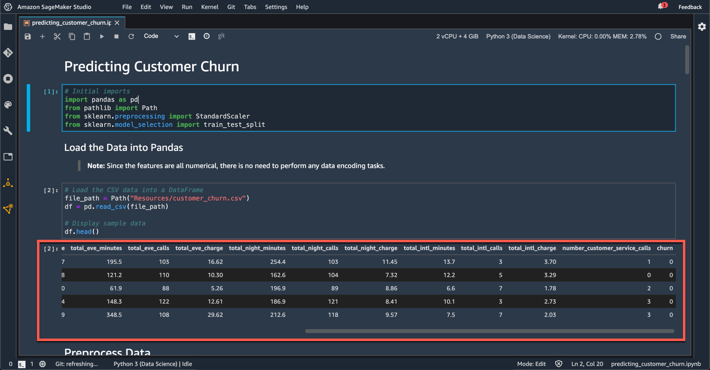

* After loading the data, we create the features and target sets. Our target will be the `churn` column, where `1` represents a customer turnover.

  ```python
  # Creating the features set X
  X = df.drop(columns=["churn"])

  # Creating the target set y
  y = df["churn"]
  ```

* Next, we split the data into training and testing datasets.

  ```python
  X_train, X_test, y_train, y_test = train_test_split(X, y, random_state=1)
  ```

* We end the data preprocessing tasks by scaling the data using the `StandardScaler` from Scikit-learn.

  ```python
  # Create a StandardScaler instance
  scaler = StandardScaler()

  # Fit the StandardScaler
  X_scaler = scaler.fit(X_train)

  # Scale the data
  X_train_scaled = X_scaler.transform(X_train)
  X_test_scaled = X_scaler.transform(X_test)
  ```

* Now we import the required module and libraries to run a model in SageMaker.

  > **Note:** We’ll go into more detail about these modules as we use them.

  ```python
  import sagemaker
  import sagemaker.amazon.common as smac
  from sagemaker import get_execution_role
  from sagemaker.predictor import csv_serializer, json_deserializer
  ```

* We also need to import the Boto3 library and several support libraries, as the following code shows:

  ```python
  # Import AWS Python SDK
  import boto3

  # Import support libraries
  import io
  import os
  import json
  import numpy as np
  ```

* After importing all the required modules and libraries, we can get started with SageMaker.

* First, we need to configure the settings that we’ll use to create our model.

* Unlike the machine learning models that we created with Scikit-learn, a SageMaker model requires that we store our preprocessed training and testing data in an Amazon S3 bucket. The SageMaker model can then use the data.

* We’ll use the S3 bucket that we created in the Module 15 Getting Started section. To store the name of the bucket, we create a variable named `bucket`, as the following code shows:

  ```python
  bucket = "fintech-bootcamp-activities-jams-2021-02-11"
  ```

  > **Note:** Remind students that they should use the name of their buckets in this code.

* To identify the data files that we’ll store in the bucket for this model, we set a prefix for these files that we store in the `prefix` variable, as the following code shows:

  ```python
  prefix = "customer-churn"
  ```

* To run our model in the cloud, we’ll also need the name of the IAM execution role that we defined when we created the Studio instance. We create a variable named `role` to store this role, as the following code shows:

  ```python
  role = get_execution_role()
  ```

Explain to students that the next step is to upload the training and testing data to Amazon S3. Continue the demo as follows:

* To train the machine learning model by using SageMaker, we first need to format our preprocessed training and testing data in the [protobuf recordIO format](https://docs.aws.amazon.com/sagemaker/latest/dg/cdf-training.html#td-serialization) and then upload it into our Amazon S3 bucket.

* Data in the protobuf recordIO format is the result of transforming structured data (similar to JSON data) into a format that allows applications to communicate with each other or to store data.

* The following code formats our training and testing data into protobuf recordIO format and then uploads it into the Amazon S3 bucket:

  ```python
  # Encode the training data as Protocol Buffer
  buf = io.BytesIO()
  vectors = np.array(X_train).astype("float32")
  labels = np.array(y_train).astype("float32")
  smac.write_numpy_to_dense_tensor(buf, vectors, labels)
  buf.seek(0)

  # Upload encoded training data to Amazon S3
  key = 'linear_train.data'
  boto3.resource("s3").Bucket(bucket).Object(os.path.join(prefix, "train", key)).upload_fileobj(buf)
  s3_train_data = "s3://{}/{}/train/{}".format(bucket, prefix, key)
  print("Training data uploaded to: {}".format(s3_train_data))

  # Encode the testing data as Protocol Buffer
  buf = io.BytesIO()
  vectors = np.array(X_test).astype("float32")
  labels = np.array(y_test).astype("float32")
  smac.write_numpy_to_dense_tensor(buf, vectors, labels)
  buf.seek(0)

  # Upload encoded testing data to Amazon S3
  key = "linear_test.data"
  boto3.resource("s3").Bucket(bucket).Object(os.path.join(prefix, "test", key)).upload_fileobj(buf)
  s3_test_data = "s3://{}/{}/test/{}".format(bucket, prefix, key)
  print("Testing data uploaded to: {}".format(s3_test_data))
  ```

* Now, before creating our machine learning model, we need to tell SageMaker which session we want to use to create and run the model. A session is tied to the AWS user or IAM user that launched Studio. We used our administrator IAM user, and because we have administrative rights, we already have all the necessary permissions for creating and running a model using Studio.

* Generally, we use the current session to proceed. The following code stores the current session in a variable named `sess`:

  ```python
  sess = sagemaker.Session()
  ```

* As we did with scikit-learn, we first need to create an instance of the machine learning model. In SageMaker, however, a model is more than a Python library.

* A machine learning model in SageMaker runs in the cloud in a container. A **container** is an [Amazon Elastic Compute Cloud (Amazon EC2)](https://aws.amazon.com/ec2/) instance - a virtual machine in the cloud - that stores and runs the model.

* The AWS infrastructure stores containers as reusable packages, called **container images**, that anyone can use to create their own containers. The first step toward creating a machine learning model is to import the container image. To do so, we import the `get_image_uri` module from the sagemaker library to create an instance of the linear learner container, as the following code shows:

  ```python
  # Import the get_image_uri module from the sagemaker library
  from sagemaker.amazon.amazon_estimator import get_image_uri

  # Import the container image
  container = get_image_uri(boto3.Session().region_name, "linear-learner")
  ```

* We now have a new container image, stored in the `container` variable, for running our machine learning model. We use the `sagemaker.estimator.Estimator` function to create an instance of the machine learning model, as the following code shows:

  ```python
  linear = sagemaker.estimator.Estimator(
    container,
    role,
    train_instance_count=1,
    train_instance_type="ml.m4.xlarge",
    output_path="s3://{}/{}/output".format(bucket, prefix),
    sagemaker_session=sess
    )
  ```

* Because the model will run on a virtual machine that Amazon EC2 supplies, the preceding code sets several parameters, such as the type of EC2 infrastructure that we want to use. In this demo, we’ll use an `ml.m4.xlarge` EC2 instance for training the model that is part of the AWS Free Tier offer.

* Now, we define the linear learner hyperparameters. It’s important to define the `feature_dim` hyperparameter so that it matches the number of predictors in the features (`X`) set. To do so, we use the Pandas `shape` function to get the number of columns in the `X` set that corresponds to the number of predictors, as the following code shows:

  ```python
  # Get the dimension of the feature-input set
  feature_dim = X.shape[1]
  ```

* After getting the number of predictors, we define the other hyperparameters for the linear learner. Note that in this case, we use `predictor_type="binary_classifier"` to allow the model to make binary classifications for customer churn (1 for churn or 0 for not-churn), as the following code shows:

```python
# Define linear learner hyperparameters
linear.set_hyperparameters(
    feature_dim=feature_dim,
    mini_batch_size=200,
    predictor_type="binary_classifier"
)
```

* We had a long journey to create a machine learning model with Amazon SageMaker. But, it was worth it, because we now have access to a model that can run in the cloud with the ability to use the computing power of AWS!

Explain to students that to fit our model, we use the `fit` function and pass the training and testing data as parameters. Recall that we uploaded the training and testing data to our Amazon S3 bucket. So, we pass the locations of these datasets in the bucket as parameters - and not the preprocessed training and testing data that we stored in Pandas - as the following code shows:

  ```python
  # Fitting the linear learner model
  linear.fit({"train": s3_train_data, "test": s3_test_data})
  ```

> **Note:** Since this step takes about 15 minutes, we are just doing a dry walkthrough demo.

Continue the demo as follows:

* Once we’ve fit the linear learner model, we can deploy it to make credit risk predictions.

* Following the pattern that we used with Scikit-learn, after fitting the model, we can use it to make predictions. Again, this process differs, because we need to deploy the model to an Amazon EC2 instance to run it.

* To have the model make predictions, we need to deploy it in a different instance than the one that we used for training. In this demo, we’ll define `ml.t2.medium` as the instance type, because this instance type is part of the free tier.

* The following code shows how to deploy the model:

  ```python
  # Deploy an instance of the linear learner model to create a predictor
  linear_predictor = linear.deploy(initial_instance_count=1, instance_type="ml.t2.medium")
  ```

* Notice that the code consists of just one line. But, that line triggers several tasks, which include deploying a new Amazon EC2 instance. Be aware that deploying the model might take a few minutes because of all the tasks that need to run.

* Before making predictions, we need to configure two items. Specifically, we need to indicate the type of the data files that we’ll use and define how the model will treat the data. In this case, we’ll send the data as CSV files and retrieve JSON files in response.

* The following code shows these configurations:

  ```python
  # Linear predictor configurations
  linear_predictor.serializer = csv_serializer
  linear_predictor.deserializer = json_deserializer
  ```

* Finally, we can make predictions! We do this in a way that’s similar to using scikit-learn. To make predictions, we use the `predict` function of the model and the preprocessed testing data that we stored in the `X_test_scaled` Python variable. We retrieve and store the prediction results in the `model_predictions` variable, as the following code shows:

  ```python
  # Making some predictions using the test data
  model_predictions = linear_predictor.predict(X_test_scaled)
  ```

* The predictions that the model makes are returned in a JSON file. This file is parsed into a Python dictionary, which is stored in the `model_predictions` variable. The `predictions` dictionary key contains all the predictions. The following code displays some of this prediction data:

  ```python
  # Display sample predictions
  model_predictions["predictions"][:3]
  ```

* Now, we create an array of the predictions so that we can evaluate the model later. To do so, we extract each predicted value from the dictionary to create a Python list, which we then transform into an array. The following code shows this process, storing the prediction results in the `y_predictions` array:

  ```python
  # Create a list with the predicted values
  y_predictions = [np.uint8(value["predicted_label"]) for value in model_predictions["predictions"]]

  # Transforming the list into an array
  y_predictions = np.array(y_predictions)

  # Display sample data
  y_predictions[:10]
  ```

* After making predictions, we can evaluate the model’s performance.

* To evaluate the predictions by using the preprocessed testing data that we stored in `y_test`, we import the `classification_report` module and then display the classification report, as the following code shows:

```python
# Import the classification report from scikit-learn
from sklearn.metrics import classification_report

# Display classification report
print("Classification report")
print(classification_report(y_test, y_predictions))
```

Explain to students that in this demo, we used only one of the built-in SageMaker algorithms. The advantage of these algorithms is two-fold: they’re optimized for working with high volumes of data, and they take advantage of the computing power of AWS.

After running a model in SageMaker Studio, highlight to students that we need to to delete the Amazon SageMaker endpoint that was created to run our model to avoid additional charges. Continue as follows:

* Each time that you use SageMaker to deploy a machine learning model, AWS creates an endpoint to communicate with other services. This endpoint is billed to your AWS account if you exceed the quota of the free tier.

* When we finish with our model, we should avoid unnecessary charges by deleting the endpoint. To do so, we run the following code at the end of our notebook:

  ```python
  # Delete Amazon SageMaker endpoint
  sagemaker.Session().delete_endpoint(linear_predictor.endpoint)
  ```

Remind students that they can also manually delete an endpoint by following the steps described in the "Introduction Lesson". Also, remind students that after finishing with SageMaker, we need to turn off the running SageMaker instance. We will do that at the end of today's session.

> **Note:** You can also delete the endpoint from the AWS Management Console. You can learn how to do this on the [Step 7: Clean Up](https://docs.aws.amazon.com/sagemaker/latest/dg/ex1-cleanup.html) page in the Amazon SageMaker Developer Guide.


Be sure that there are no questions before moving forward.

---

### 6. Student Do: Preventing Money Laundering Using Amazon SageMaker Studio (30 min)

In this activity, students will gain hands-on experience in deploying a machine learning model into the cloud to predict whether or not a cash or transfer bank transaction is potential money laundering fraud. They'll use the the SageMaker built-in Linear Learner algorithm.

This activity will require the use of an Amazon SageMaker Studio instance; the unsolved notebook will guide students through the process and indicate what the missing code snippets are.

> **Note:** Remember that the time needed to train and deploy the model is about 15 minutes.

Explain to students that they will work in groups of 2 or 3 people. They should choose one person of the group to share their screen as they walk through each cell of code one by one while inspecting and commenting about the code they are going to execute.

Create [Zoom Breakout Rooms](https://support.zoom.us/hc/en-us/articles/206476313-Managing-breakout-rooms) of 2-3 students. Zoom can automatically assign random students to the rooms based on the number of participants you want in each room.

Consider making a room specifically for instructional staff to prevent creating groups of students that are smaller than intended.

> **Important:** If class is being recorded to the cloud, only the main room will be recorded. However, if class is being recorded locally, it will record whichever room the host is in. Keep this in mind when having private conversations with your instructional team.

Slack-out the instructions and be aware if any group requires further assistance.

**Files**:

* [README.md](Activities/03_Stu_Money_Laundering/README.md)

* [predicting_money_laundering.ipynb](Activities/03_Stu_Money_Laundering/Unsolved/predicting_money_laundering.ipynb)

* [money_laundering.csv](Activities/03_Stu_Money_Laundering/Resources/money_laundering.csv)

#### Instructions

* You will work in groups of 2 or 3 people. You should choose one person of the group to share their screen as the group walks through each cell of code one by one while inspecting and commenting about the code you are going to execute.

1. Open your Amazon SageMaker Studio, and upload the provided `predicting_money_laundering.ipynb` notebook.

2. Walk through the cell steps and add any missing code.

3. The notebook will guide you through the process to create, train and deploy a supervised *classification* model using the Amazon SageMaker's built-in Linear Learner algorithm.

4. Take a look at the [Amazon SageMaker Linear Learner Algorithm documentation](https://docs.aws.amazon.com/sagemaker/latest/dg/linear-learner.html) if you have any questions about how it works.

---

### 7. Instructor Do: Review Preventing Money Laundering Using Amazon SageMaker Studio (10 min)

Take a moment to check in with the class and see how comfortable they're feeling with using Amazon SageMaker Studio to deploy a machine learning model.

Stop sharing your screen for a moment and switch to Gallery View. Ask your class to rate their level of understanding by raising their hand for a "Fist-to-Five" check. Use the feedback from this check to recommend Office Hours to review things more in depth, or adjust your pace throughout the activity review.

**Files**:

* [predicting_money_laundering.ipynb](Activities/03_Stu_Money_Laundering/Solved/predicting_money_laundering.ipynb)

* [money_laundering.csv](Activities/03_Stu_Money_Laundering/Resources/money_laundering.csv)

Conduct a dry walkthrough review of the solved version of the notebook as follows:

* Open Amazon SageMaker Studio.

* Upload the provided dataset to a new folder called `Resources`.

* Upload the provided solved notebook to the root folder of SageMaker Studio.

* Walk-through the solved notebook, cell by cell, highlighting the following points:

  * The output of the model prediction is a binary label (0, 1): "non-fraudulent" or "fraudulent" transaction.

  * Despite using a "curated" dataset, we still need to perform some data preparation tasks: *hot-encode*, *split*, and *scale* the input features.

  * We use the AWS SageMaker built-in `linear-learner` algorithm by setting the hyper-parameter `predictor_type` to "binary_classifier".

  * The predictions are in the `predictions` list in the prediction result.

  * Lastly, for our model evaluation, we use the classification report to get a quick sense of the model's true-positive/negative and false-positive/negative prediction combinations.

Answer any questions before moving on.

---

### 8. Instructor Do: Recap (10 min)

Congratulate students for reaching the last live class of the machine learning section! In today's class, they were able to put their previous Python skills into practice in combination with the cloud's power to deploy a machine learning model.

Explain to students that though Amazon SageMaker is not required for this module's challenge, it remains a valuable skill in the FinTech job market, especially for companies looking to automate their machine learning pipelines.

Explain to students that Amazon SageMaker is a service that can be connected to other AWS services to build end-to-end machine learning applications. Start sharing your screen, open your browser and navigate to the [Amazon SageMaker customers page](https://aws.amazon.com/sagemaker/customers/) to walk through the various industrial applications where SageMaker is being used.

Remind students that they should stop their SageMaker Studio running instances and delete their endpoints to avoid additional costs and billing from AWS. Refer students to the Getting Started section of the Introduction lesson to review this process.

Be sure to review the steps required to stop the SageMaker Studio running instances and delete endpoints. Conduct a demo if it's requested by the students.

Answer any questions before moving on.

---

## Open Office Hours

### Q&A and System Support

This is an opportunity to support students in any way that they require.

* Offer personalized support for students. (**Note:** feel free to pair individual students off with instructional staff as needed.)

* Ask the students if they have any questions about the material covered in today's live lesson.

* Ask students if they have any questions about the material covered in the async content or the Challenge assignment.

---

© 2021 Trilogy Education Services, a 2U, Inc. brand. All Rights Reserved.
